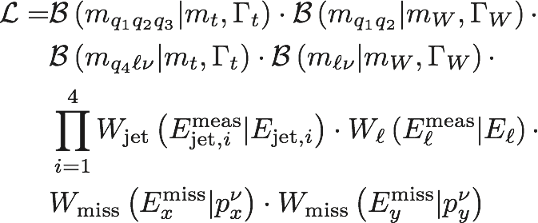
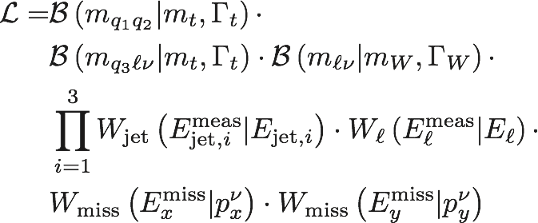
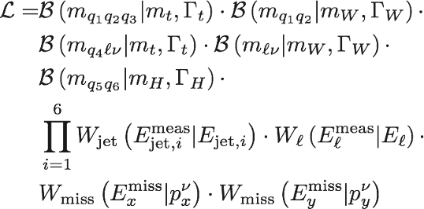
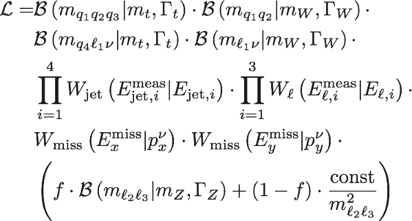

# KLFitter—the Kinematic Likelihood Fitter

### Introduction

In the Kinematic Likelihood Fitter, the four-vectors of the measured objects in
a given event are used to fit them to the kinematic properties of a given model
signature. During the fit (performed with [BAT](http://www.mppmu.mpg.de/bat/)),
the four-vectors of the measured objects are varied according to
detector-specific transfer functions in order to best correspond to the
signature. The agreement between the event and the model signature is quantified
with a likelihood, which is specific to the signature. In principle, the
KLFitter library can be used to fit many kinds of signatures if the user defines
the corresponding likelihood. So far, the main use case is the reconstruction of
top-quark events at particle colliders, for which several likelihoods are
provided in the KLFitter library, as described below.

The most common application of KLFitter is the reconstruction of top-quark pair
events at the LHC, i.e. the determination of the association of measured
objects, in particular jets, to the decay products of the top-quark pair decay.
For each considered association of objects to decay products ("permutation"),
the likelihood function is maximized during the fit. After fitting all
permutations in an event, a probability is calculated for each permutation, from
which a ranking of permutations is derived. The permutation with the highest
probability is called "best permutation" and is considered the most likely
association of objects to decay products within the model.


### Reference

If you are using KLFitter, please consider citing the KLFitter paper:

> J.Erdmann, S.Guindon, K.Kröninger, B.Lemmer, O.Nackenhorst, A.Quadt and
> P.Stolte, *A likelihood-based reconstruction algorithm for top-quark pairs and
> the KLFitter framework*, [Nucl. Instrum. Meth. A 748 (2014)
> 18](https://arxiv.org/ct?url=http%3A%2F%2Fdx.doi.org%2F10%252E1016%2Fj%252Enima%252E2014%252E02%252E029&v=2764f62f).

A list of works citing the KLFitter paper can be found [on
inspire](https://inspirehep.net/search?ln=en&p=refersto%3Arecid%3A1272847).


## Reconstruction of top-quark events

### Lepton+jets ttbar events

The following likelihood is implemented in the class `LikelihoodTopLeptonJets`
for the reconstruction of lepton+jets ttbar events. It uses the four-momenta of
four jets and one charged lepton and the two components of the missing
transverse momentum in order to associate them with the decay topology of the
ttbar decay. Out of the 24 parameters of the 6 objects, only the 4 jet energies,
the energy of the charged lepton and the three-momentum of the neutrino are
parameters of the fit. The likelihood consists of four Breit-Wigner terms
B(...), which quantify the agreement of the fitted four-vectors with the decay
products of the ttbar pair, and of seven transfer functions W(...) that quantify
the agreement of the fitted energies and missing-transverse-momentum components
with their measured values.



Please note the difference with respect to the likelihood documented in the
KLFitter paper, in which a Gaussian was used instead of the second Breit-Wigner
function.

The mass and width of the W boson are fixed. The top-quark mass can be chosen to
be fixed or to be a free parameter of the fit. The top-quark mass can also set
to a desired value. In that case, the top-quark width is recalculated.

```c++
LikelihoodTopLeptonJets::SetFlagTopMassFixed(bool flag)
LikelihoodTopLeptonJets::PhysicsConstants()::SetMassTop(double mass)
```

If more than the minimum number of objects is passed to the likelihood, for
example more than four jets, all possible permutations are considered in the
fit, i.e. five times more permutations if five jets are passed to the likelihood
compared to the four-jet case, and the event probability is calculated taking
all of these permutations into account. The probability for each permutation
("event probability"), from which the order of the permutations and the "best
permutation" are derived, is defined by the likelihood of each permutation
divided by the sum of likelihoods of all permutations. For technical reasons,
the logarithm of the likelihood is maximized during the fit, so that the event
probability is calculated from the exponential of the logarithm of the
likelihood.

Variants of `LikelihoodTopLeptonJets` have been developed that take take
additional information into account in the fit:

- In `LikelihoodTopLeptonJets_JetAngles`, the pseudorapidity and the azimuth
  angle of the jets are additional parameters during the fit (8 additioal
  parameters). Transfer functions for the jet angles are necessary.
- In `LikelihoodTopLeptonJets_Angular`, the probability distributions for the
  distribution of cos(theta*) of the leptonically and hadronically decaying W
  boson, as predicted in the Standard Model, are multiplied to the likelihood
  function.
- In `LikelihoodTopLeptonJetsUDSep`, up-type and down-type quarks from the
  hadronic W-boson decay are distinguished. An additional probability is
  calculated to the event probability in each permutation based on the
  transverse momentum of the four jets and their value of the flavor-tag
  discriminator according to probability density functions for these two
  variables, which are different b-quarks, up-type quarks and down-type-quarks.
  The value of the flavor-tag discriminator needs to be passed to KLFitter for
  each jet. In addition, the probability density functions need to be provided:

```c++
LikelihoodTopLeptonJetsUDSep::SetBJetPtHisto(TH1F* hist)
LikelihoodTopLeptonJetsUDSep::SetUpJetPtHisto(TH1F* hist)
LikelihoodTopLeptonJetsUDSep::SetDownJetPtHisto(TH1F* hist)
LikelihoodTopLeptonJetsUDSep::SetBJetTagWeightHisto(TH1F* hist)
LikelihoodTopLeptonJetsUDSep::SetUpJetTagWeightHisto(TH1F* hist)
LikelihoodTopLeptonJetsUDSep::SetDownJetTagWeightHisto(TH1F* hist)
```


### Boosted lepton+jets ttbar events

The following likelihood is implemented in the class
`BoostedLikelihoodTopLeptonJets` for the reconstruction of lepton+jets ttbar
events with a high momentum of the hadronically decaying top quark, in which the
decay products of from the hadronically decaying W boson are merged to form only
one jet instead of two. This likelihood has the potential to outperfrom
`LikelihoodTopLeptonJets` for transverse momenta of the hadronically decaying W
boson of about 400 GeV. In comparison to `LikelihoodTopLeptonJets`, this
likelihood only considers three instead of four jets and does not consider any
constraint on the mass of the hadronically decaying W boson. Hence, it does not
make use of the mass of the merged jet.




### Allhadronic ttbar events

The following likelihood is implemented in the class `LikelihoodTopAllHadronic`
for the reconstruction of allhadronic ttbar events. It consists of Breit-Wigner
distributions for the top-quarks and the W-bosons and transfer functions for the
six jets. As in the case of `LikelihoodTopLeptonJets`, the top-quark mass can be
chosen to be fixed or a free parameter in the fit.


### Dileptonic ttbar events

The following likelihood is implemented in the class `LikelihoodTopDilepton` for
the reconstruction of dileptonic ttbar events. It uses the four-momenta of two
jets and two charged leptons and the two components and the missing transverse
momentum in the neutrino-weighting method to solve the underconstrained
kinematic system. The likelihood consists of the transfer functions for the two
charged leptons and the two jets, as well as Gaussian functions G(...) that
describe the transfer function of the missing transverse momentum as a function
of the neutrino four-momenta and the probability density function of the
neutrino pseudorapidity distributions. The resolution of the transfer functions
depends on the values of the top-quark and W-boson masses and the
neutrino-pseudorapidities. The width of the probability density functions for
the neutrino pseudorapidities depend slightly on the value of the top-quark
mass. This dependence can be set via
`LikelihoodTopDilepton::SetEtaNuParams(std::vector<double> etanuparam)`. The
default dependence is linear with `etanuparams` corresponding to the a and b in
"sigma = a + b * m_top". Alpha is a tuning parameter of the likelihood and is
set to -2. Up to two momentum solutions exist for each neutrino, and the
likelihood is calculated for each of them and their results are added together.
The likelihood distinguishes between neutrinos and anti-neutrinos and the
charged leptons are paired accordingly.


The default minimization method for this likelihood is not Minuit, but simulated
annealing. However, also Markov Chain Monte Carlo (MCMC)can be used. The
settings of the minimization can be set via (with the values below being the
default values):

```c++
LikelihoodTopDilepton::MCMCSetFlagFillHistograms(true);
LikelihoodTopDilepton::MCMCSetNChains(5);
LikelihoodTopDilepton::MCMCSetNIterationsRun(20000);
LikelihoodTopDilepton::MCMCSetNIterationsMax(1000000);
LikelihoodTopDilepton::MCMCSetNIterationsUpdate(100);
LikelihoodTopDilepton::MarginalizeAll();
```

The user must also set the number of chains (`NChains = 5` above) in the
`LikelihoodTopDilepton::Initialize()` in `LikelihoodTopDilepton.cxx`:

```c++
SetInitialParametersNChains( GetInitialParameters(), NChains );
```

In order to get the MCMC convergence status after the specified
`MCMCNIterationsMax`, the following line needs to be included in the user's main
code:

```c++
m_convergenceStatusBest = bool((myFitter->Likelihood()->MCMCGetNIterationsConvergenceGlobal() > 0) && myFitter->Likelihood()->MCMCGetFlagRun())
```

A marginalized histogram with respect to a certain fit parameter a can be
obtained in the user's main code by:

```c++
(TH1D *)myFitter->Likelihood()->GetMarginalized(BCParameter * a)->GetHistogram()
```

where `a = myFitterElEl->Likelihood()->GetParameter(0)`, in case the top mass is
the parameter of interest.

In case the top mass is fixed, unlike in the Minuit case in
`LikelihoodTopLeptonJets`, in MCMC a sharp Gaussian prior is set, with its width
taken from the LHC top mass combination´s uncertainty, and the allowed parameter
range is set to 3 times this LHC uncertainty:

```c++
if (fFlagTopMassFixed)
    SetPriorGauss(0,fPhysicsConstants->MassTop(),fPhysicsConstants->MassTopUnc());

if (fFlagTopMassFixed)
    SetParameterRange(parTopM, fPhysicsConstants->MassTop()-3*fPhysicsConstants->MassTopUnc(), fPhysicsConstants->MassTop()+3*fPhysicsConstants->MassTopUnc());
```

The function `LikelihoodTopDilepton::MCMCIterationInterface()` allows to
calculate variables of interest out of the fit parameters for each MCMC
iteration. Given the ambiguity of neutrino momentum solution mentioned above,
all combinations are taken into account. A `TH1D` histogram can be filled for
each variable of interest and must be defined in
`LikelihoodTopDilepton::DefineHistograms()`.

The best permutation option is the one set as default, analogously to
`LikelihoodTopLeptonJets`: the jet permutation with the highest event
probability value is chosen. However another option can be enabled, the
sum-log-likelihood option, which performs the sum of the two jet permutations
inside the function `LikelihoodTopDilepton::LogLikelihood(const std::vector &
parameters)`, being similar to the original neutrino-weighting method. The
latter option can be enabled adding the following line in your user's main code:
`myLikelihood -> SetDoSumLogLik(true)`.


### ttbar+H events

The following likelihood is implemented in the class `LikelihoodTTHLeptonJets`
for the reconstruction of lepton+jets ttbar+H events, in which the Higgs boson
decays into a b-quark and an anti-b-quark. This likelihood is based on
`LikelihoodTopLeptonJets` (described above), adding the Breit-Wigner
distribution for the Higgs-boson and two transfer functions for the additional
b-quarks.



As in the case of `LikelihoodTopLeptonJets`, the top-quark mass can be chosen to
be fixed or a free parameter in the fit. The Higgs-boson mass can also be fixed
or treated as a free parameter in the fit. It can also be set to a desired
value. In this case, the Higgs-boson width is recalculated accordingly.

```c++
LikelihoodTTHLeptonJets::SetFlagHiggsMassFixed(bool flag)
LikelihoodTTHLeptonJets::PhysicsConstants()::SetMassHiggs(double mass)
```


### ttbar+Z events

The following likelihood is implemented in the class `LikelihoodTTZTrilepton`
for the reconstruction of lepton+jets ttbar+Z events, in which the Z-boson
decays into two charged leptons with the same flavor as the charged lepton from
the decay of the top-quark pair. The likelihood is based on
`LikelihoodTopLeptonJets` (described above) and extends it by two charged
leptons. The likelihood includes the transfer functions of the additional
leptons and the sum of two terms that take into account

- the on-shell production of two charged leptons with a Breit-Wigner
  distribution with mass and width of the Z boson, weighted with fraction f, and
- the off-shell production of two charged leptons with the expected inverse
quadratic dependence on the invariant mass of the two leptons, weighted with the
fraction (1-f). The cut-off constant that appears in the off-shell part of the
likelihood can be set by the user.




### Single-top t+W events

The following likelihood is implemented in the class `LikelihoodSgTopWtLJ` for
the reconstruction of the associated production of a single top quark and a W
boson in the lepton+jets channel. In comparison to `LikelihoodTopLeptonJets`,
this likelihood contains only three instead of four jets. Two variants of the
likelihood are provided: one variant assumes that the top quark decays
semileptonically, the other variant assumes that it decays full hadronic. The
user can switch between these two variants by setting:

```c++
LikelihoodSgTopWtLJ::SetHadronicTop()
LikelihoodSgTopWtLJ::SetLeptonicTop()
```


### Using flavor-tagging information

There are several ways of considering flavor-tagging information in KLFitter,
which can be set for the likelihoods via the
`LikelihoodBase::SetBTagging(BtaggingMethod btagmethod)` method in the base
class of all likelihood classes. The following options are available. They
require that the b-tagging information for the jets is passed to KLFitter.

- Option `LikelihoodBase::kNoTag`: Flavor-tagging information is ignored.
- Option `LikelihoodBase::kVetoNoFit`: Permutations in which a b-tagged jet is
  associated with a light quark from the top-quark decay are removed from the
  fitting procedure.
- Option `LikelihoodBase::kVetoNoFitLight`: Permutations in which a non-b-tagged
  jet is associated with a b-quark from the top-quark decay are removed from the
  fitting procedure.
- Option `LikelihoodBase::kVetoNoFitBoth`: Permutations in which a either a
  b-tagged jet is associated with a light quark from the top-quark decay or a
  non-b-tagged jet is associated with a b-quark from the top-quark decay are
  removed from the fitting procedure.
- Option `LikelihoodBase::kVeto`: Same as `kVetoNoFit`, but the fit is performed
  and the event probability for that permutation is set to zero.
- Option `LikelihoodBase::kVetoLight`: Same as `kVetoNoFitLight`, but the fit is
  performed and the event probability for that permutation is set to zero.
- Option `LikelihoodBase::kVetoBoth`: Same as `kVetoNoFitBoth`, but the fit is
  performed and the event probability for that permutation is set to zero.
- Option `LikelihoodBase::kWorkingPoint`: With this option, b-tagging
  information is not used to veto events, but to multiply the event probability
  with a b-tagging probability. It is calculated from the product of the
  b-tagging probabilitites of the individual jets by assigning:
  - the b-tagging efficiency (one minus the b-tagging efficiency) for each
    b-tagged (non-b-tagged) jet that is in the position of a b-quark from the
    top-quark decay;
  - the inverse of the light-quark rejection (one minus the inverse of the
    light-quark rejection) for each b-tagged (non-b-tagged) jet that is in the
    position of a light-quark from the top-quark decay.

  The b-tagging efficiency (a number between 0 and 1) and the light-quark
  rejection (a number larger than 1) have to be passed for every jet to
  KLFitter. This allows to take a varying b-tagging efficiency per jet into
  account (for example via scale factors). Please note that the b-tagging
  probability is multiplied to the event probability, not to the (log)
  likelihood.


## Transfer functions

The transfer functions W(measured property | true property) are a
parametrization of the detector response, for example for the measured jet
energy given the true energy of a parton. These parametrizations are
detector-specific and in general need to be derived by the user for their
specific application. Gaussian and double-Gaussian parametrizations are
pre-defined in KLFitter with the specific parameters to be determined by the
user. Alternative parametrizations are in principle possible. A tool is provided
for the derivation of double-Gaussian transfer functions,
[TFtool](https://gitlab.cern.ch/KLFitter/TFtool).


## Minimization algorithm

During the fit, the negative logarithm of the likelihood is minimized with
minimization methods that are available from the
[BAT](http://www.mppmu.mpg.de/bat/) library. The default algorithm for
minimizaton is Minuit. Alternatively, simulated annealing or Markov Chain Monte
Carlo can be used:

```c++
Fitter::SetMinimizationMethod(Fitter::kMinuit)
Fitter::SetMinimizationMethod(Fitter::kSimulatedAnnealing)
Fitter::SetMinimizationMethod(Fitter::kMarkovChainMC)
```


## Class structure

The KLFitter package is build in a modular way so as to allow the implementation
of different physics processes and parameterizations of the detector response.
All classes live in the `KLFitter` namespace. The class structure is as follows:

The central class is `Fitter`. It contains objects which describe the detector
(an instance of `DetectorBase`), the input particles (an instance of
`Particles`) and the likelihood (an instance of `LikelihoodBase`). An additional
object, an instance of `Permutations`, helps to manage the possible permutations
of jets to quarks, and leptons.

The `DetectorBase` class summarizes the detector information. It contains
several objects (instances of `ResolutionBase`) describing the parameterization
(transfer functions) of, e.g., energy resolutions for different particle types.
The description of a detector should be done by creating a class which inherits
from `DetectorBase`. The resolution objects can be created by additional classes
which inherit from `ResolutionBase`. An example exists for a dummy detector with
Gaussian energy resolutions.

The `Particle` class holds containers for different types of particles, partons,
electron, muons, tau leptons, neutrinos, photons and boson. Parton-level and
reconstructed particles are both described with this class.

The actual fitting procedure is done in the `LikelihoodBase` class. This class
inherits from the BAT `BCModel` class. In order to implement a new process, the
user has to create a class which inherits from `LikelihoodBase`.


## Using KLFitter

### Setting the measured quantities

The measured quantities are the four-vectors of jets and charged leptons, as
well as the missing transverse momentum components. An object of type
`Particles` is passed to the `Fitter` object. The input quantities can either be
set by defining `TLorentzVectors` and adding them to Particles object, or by
using an interface. An example for a ROOT interface exists which reads the data
from a flat ROOT tree.

### Combinatorics

The association of jets with partons and of reconstructed and parton-level
leptons leads to several possible combinations. The class Permutations
calculates a table with all possible permutations. A specific combination
(index) can be set by the user,

```c++
Permutations::SetPermutation(int index)
```

In case interchanging two (or several) particles leaves the likelihood invariant
two (several) indices can be defined which are interchangeable (for example for
the decay products from a hadronically decaying W bosons). The corresponding
permutations are removed from the table. The indices can be set via

```c++
LikelihoodBase::InvariantPartonPermutations(int index1, int index2, int index3 = -1)
```


### Output

**NEEDS A GENERAL DISCUSSION ABOUT HOW TO RETRIEVE THE OUTPUT FROM THE FIT
(WITHIN THE USER CODE). IT SHOULD ALSO INCLUDE A BRIEF DESCRIPTION OF THE FIT
CONVERGENCE AND OTHER ERROR FLAGS.**
